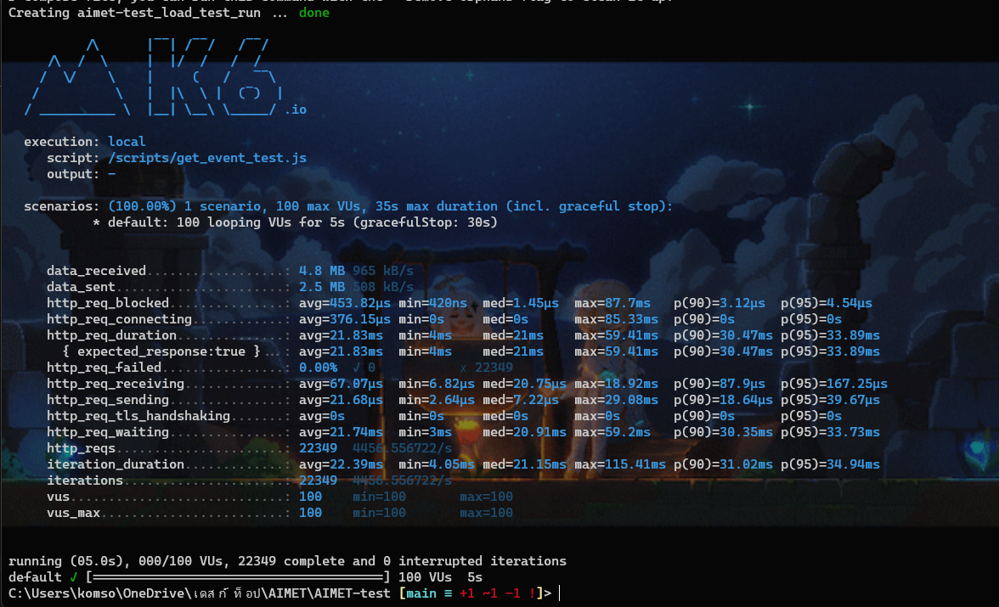

# AIMET-test Backend

## Table of content

- **[How To Run This Project](#how-to-run-this-project)**

  - [Run The Whole System](#run-the-whole-system)

  - [Generate Mock Event Data](#generate-mock-event-data)

- **[API Specification](#api-specification)**

  - [GET Events](#get-events)

- **[System Architecture](#system-architecture)**

- **[Database Design Schema](#database-design-schema)**

  - [Event Collection Schema](#event-collection-schema)

- **[Backend Architecture / Folder Structure](#backend-architecture--folder-structure)**

- **[Testing](#testing)**

  - [How To Run Unit Tests](#how-to-run-unit-tests)

  - [How To Run Integration Tests](#how-to-run-integration-tests)

  - [How To Run K6 Load Tests](#how-to-run-k6-load-tests)

## How To Run This Project

The easiest way to run this project, we will use `docker` and `docker-compose` command to build and run in every service (except unit & integrate testing). So you will need to install the `docker` and `docker-compose` before go to the next step. (I will recommend you to use `docker-compose` version `1.29.2` or higher)

### Run The Whole System

1. **Environment file preparation**
   First of all, you will need to prepare the `.env` file to declare the system environment variable that use to create a database and service connection. The example of `.env` is in the file [.env.template](.env.template). You will need to create the `.env` file and put it in the same directory as `.env.template`.

   - `MONGO_ROOT_USER` is a MongoDB root user name.

   - `MONGO_ROOT_PASSWORD` is a MongoDB root user password.

   - `MONGO_INITDB_DATABASE` database name that we will use to store the data.

   - `MONGO_INITDB_USER` is a MongoDB username the other service will use to create connection to the database.

   - `MONGO_INITDB_PWD` is a password of init user.

2. **Run the system**
   In this step we will run the whole system with `docker-compose` command. If everything success the container name `nginx`, `redis`, `mongo`and `backend` will be running in you computer. Use the following command to build and run the system.

   ```bash
   docker-compose up -d --build
   ```

   To verify that the system run completely, run the command.

   ```bash
   curl -v "http://localhost/api/v1/events?month=1"
   ```

   You should get response with `HTTP/1.1 200 OK`. If you found `502 Bad Gateway` you might to restart a nginx container.

### Generate Mock Event Data

In this step, we will generate mock event data and insert it into our MongoDB. Please ensure that you [run the whole system](#run-the-whole-system) completely.

1. **Generate and insert event data**
   Run the following command to generate a random event and insert it into our MongoDB.

   ```bash
   docker-compose -f docker-compose.mockData.yml run --rm mock_data
   ```

   To make sure that the step is complete, use the tools like `MongoDBCompass` or `mongosh` to connect to your database. You should found that the events collection will have ~100,000 record.

## API Specification

### GET Events

- **Request:**
  **GET** **[http://localhost/api/v1/events?month={{month}}&year={{year}}&day={{day}}&keyword={{keyword}}&sort_by={{sort_by}}](null)**
  | Parameter | Required | Type | Description |
  | --------- | -------- | ---- | ----------- |
  | `month` | require | string | The numeric value of the month (1-12) for which to retrieve events data. |
  | `year` | optional | string | The numeric value of the year for which to retrieve events data. If not provided, defaults to the current year. |
  | `day` | optional | string | The numeric value of the day for which to retrieve events data. If not provided, returns all events data for the month. |
  | `keyword` | optional | string | A string containing a keyword to search for in the events data name. |
  | `sort_by` | optional | string | Specifies the field to sort by. Valid values are `date` (default) and `time`. |

- **Response:**

  - `200 OK` with a JSON object containing an array of events data.

  - `400 Bad Request` if the request is missing the month parameter, the month parameter is not a valid numeric value, or the date is invalid.

  - `500 Internal Server Error` if there is an error retrieving the events data.

- **Response Example**

  ```json
  {
    "count": 3,
    "events": [
      {
        "name": "Event 43021",
        "date": "2021-03-03T00:00:00Z",
        "start_time": "2:16 AM",
        "end_time": "10:54 AM"
      },
      {
        "name": "Event 16589",
        "date": "2021-03-09T00:00:00Z",
        "start_time": "8 AM",
        "end_time": "9:59 AM"
      },
      {
        "name": "Event 48184",
        "date": "2021-03-12T00:00:00Z",
        "start_time": "8:47 AM",
        "end_time": "11 PM"
      }
    ]
  }
  ```

## System Architecture

## Database Design Schema

### Event Collection Schema

- **Collection Name:** [events](null)

- **Schema:**
  | Field | Type | Description |
  | ----- | ---- | ----------- |
  | `_id` | ObjectId | A unique identifier for the event document. |
  | `name` | String | The name or title of the event. |
  | `date` | Date | The date of the event. |
  | `start_time` | String | The start time of the event as a string in the format hh:mm. (ex. 09:30, 12:00, or 23:50) |
  | `end_time` | String | The end time of the event as a string in the format hh:mm. |

## Backend Architecture / Folder Structure

In this project, we referent the template layout from [https://github.com/golang-standards/project-layout](https://github.com/golang-standards/project-layout), And in the `/backend/internal`, we use **"Clean Architecture"** for development.

- **Backend Folder Structure**

  ```bash
  ├── cmd
  │   └── app
  │       └── main.go
  ├── configs
  │   ├── configs.yml
  │   └── service.go
  ├── internal
  │   ├── databases
  │   │   ├── mongo.go
  │   │   └── redis.go
  │   ├── domains
  │   │   ├── controllers.go
  │   │   ├── usecases.go
  │   │   └── repositories.go
  │   ├── models
  │   │   └── event.go
  │   ├── controllers
  │   │   └── event_controller.go
  │   ├── usecases
  │   │   └── event_usecase.go
  │   ├── repositories
  │   │   └── event_repository.go
  │   ├── middlewares
  │   └── router
  ├── go.mod
  └── go.sum
  ```

  - `cmd`: This folder contains the main.go file, which sets up the application and starts the server.

  - `configs`: This folder contains configuration files for the application, such as database configuration.

  - `internal`: This folder contains the domain logic and the infrastructure code.

    - `databases`: This folder contains the code that handle databases connection.

    - `domains`: This folder contains the interface domain of controllers, usecases, and repositories.

    - `models`: This folder contains struct and entities.

    - `controllers`: This folder contains code that handle http request and response.

    - `usecases`: This folder contains the business logic.

    - `repositories`: This folder contains the adaptor to any service like database or redis.

    - `middlewares`: This folder contains middleware. (protect, allow-origin, etc.)

    - `router`: This folder contains route that map API endpoint to any controller function.

## Testing

### How To Run Unit Tests

We use a package [stretchr/testify](https://github.com/stretchr/testify) to create a mock for testing. In this step we don't need to [run the whole system](#run-the-whole-system), it just a unit test. First of all, go to directory `/backend`.

```bash
cd ./backend
```

Download the require or missing Golang package.

```bash
go mod download
```

Then, run the test.

```bash
go test ./...
```

To see more test detail, use the tag `-v`.

```bash
go test ./... -v
```

Or to test the specific package, this is the example.

```bash
go test aimet-test/internal/usecases -v
```

### How To Run Integration Tests

To run the integration test we will add `-tags=integration` in `go test` command.

```base
go test aimet-test/internal/controllers -v -tags=integration
```

Go test will also build and run your integration test and serve it to your test result.

### How To Run K6 Load Tests

We will use a tools like [K6](https://k6.io/docs/) to verify our project performance (!it depend on what your computer that you use to run the service).

Use the following command to run load test. (test at 100 concurrent in 5 seconds)

```bash
docker-compose -f docker-compose.test.yml run --rm load_test run /scripts/get_event_test.js
```

You will see the test result. Like this


